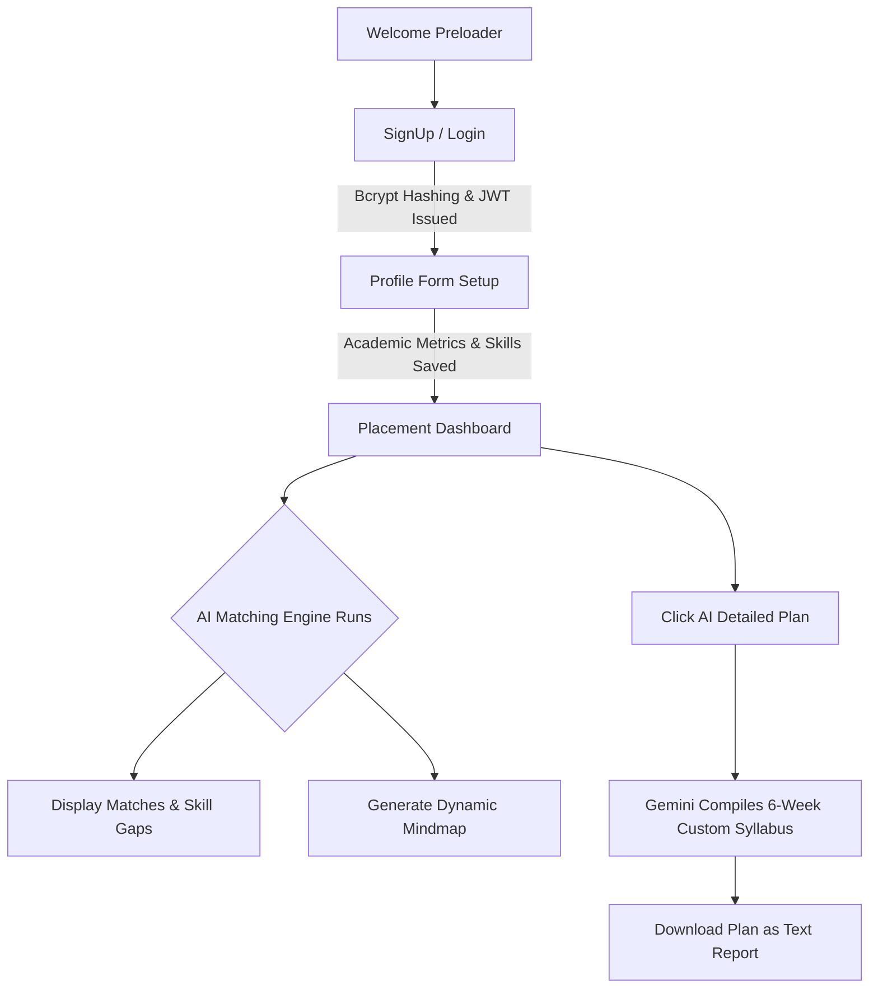

# 🚀 SkillSprint v2.0

> A Premium Full-Stack Placement Preparation Platform powered by **Hybrid Intelligence** (Google Gemini API & Local Reasoning Engine) packaged for Web, Android, and iOS.

---

## 🌟 Key Features

### 🎬 Cinematic UI & Immersive Experience
* **Neural Preloader Overlay**: Animated loading screen featuring dynamic messages simulating AI calibration.
* **3D Mouse Parallax & Hover Tilt**: Tech node elements on the landing page and the dashboard welcome banner rotate and pivot in 3D perspective based on cursor coordinates.
* **Particle Physics Engine**: Custom lightweight javascript particles floating in the background, automatically disabled on mobile screens for battery savings.
* **Premium Glassmorphic Aesthetics**: Curated dark and light theme tokens, blur backdrops, and gradient boundaries powered by Tailwind CSS and custom keyframe animations.

### 🧠 Hybrid AI Reasoning Engine
* **Multilayer Fallback Strategy**: 
  1. Tries **Gemini 1.5 Flash** for rapid text generation.
  2. Falls back to **Gemini Pro** / **Gemini 1.5 Pro** if limits are hit or models fail.
  3. Seamlessly defaults to a **Local Company DB Engine** if offline or API keys are missing.
* **Prompt Injection Resilience**: Dynamic local parsing converts unstructured AI outputs securely into JSON data arrays.

### 📊 Placement Analytics Dashboard
* **Compatibility Scoring**: Automatically matches student CGPA, branch, and technical skillsets to target parameters at top companies (Google, Microsoft, Amazon, Adobe, TCS, Infosys, Netflix, Meta).
* **Visual Skill Gap Analysis**: Maps student credentials against company stacks. Displays qualifying skills in **Emerald Pills** and critical missing skills in **Rose Pills**.
* **Interactive Mindmap Roadmap**: A dynamic tree diagram with nodes that can be expanded or collapsed to detail stages of development.
* **AI Syllabus Generator**: Creates a personalized week-by-week curriculum based on missing profile skills, downloadable as a text file report.

---

## 📂 Project Architecture

```
d:\krt\
├── server.js                 # Express.js server (REST APIs, Static serving, AI Engine)
├── models/                   # Mongoose DB Schemas
│   ├── User.js               # Users (username, email, password hashing)
│   └── Profile.js            # Profiles (skills, CGPA, target disciplines, metrics)
│
├── www/                      # ⭐ Combined Web & Mobile Assets (Primary Frontend)
│   ├── index.html            # Landing / Marketing Page
│   ├── login.html            # User login
│   ├── signup.html           # User registration
│   ├── form.html             # Skill DNA profile config
│   ├── dashboard.html        # Interactive AI placement dashboard
│   ├── app.js                # Core frontend client (API sync, animations, logic)
│   ├── style.css             # Main styling, tokens, keyframes
│   ├── mobile.css            # Mobile platform safety overrides (notches, safe areas)
│   └── assests/              # Video demonstrations & image assets
│
├── android/                  # Native Android Studio Project (Capacitor)
├── ios/                      # Native Xcode Project (Capacitor)
└── capacitor.config.json     # Capacitor configuration
```

---

## ⚡ Quick Start

### Prerequisites
* [Node.js](https://nodejs.org/) installed (v18+ recommended)
* [MongoDB](https://www.mongodb.com/) (Local server or MongoDB Atlas Cluster)

### 1. Clone & Install Dependencies
```bash
npm install
```

### 2. Configure Environment Variables
Create a `.env` file in the root directory:
```env
MONGODB_URI=mongodb+srv://<username>:<password>@cluster0.mongodb.net/skillsprint
API_KEY=your_google_gemini_api_key_here
PORT=5000
```

### 3. Start Backend Server
```bash
node server.js
```
*You should see output indicating MongoDB is connected successfully.*

### 4. Run the Frontend
Since `server.js` serves the static assets:
* Open `http://localhost:5000` in your web browser.

---

## 📱 Mobile App Development (Capacitor)

SkillSprint utilizes **Capacitor** to deploy the `www/` codebase natively onto mobile platforms.

### Android Setup
1. Ensure Android Studio and the Android SDK are installed.
2. Open the project inside Android Studio:
   ```bash
   npx cap open android
   ```
3. Run on an emulator or a physical device connected via USB.

> [!TIP]
> **Local API Resolution**: While testing on the Android emulator, `www/app.js` is pre-configured to automatically map all `/api` endpoints to `http://10.0.2.2:5000`, which correctly routes traffic to your computer's local Express server.

### iOS Setup (Mac only)
1. Ensure Xcode is installed.
2. Open the project inside Xcode:
   ```bash
   npx cap open ios
   ```
3. Choose a device simulator and press **Run**.

### Syncing Code Changes
If you modify any files in the `www/` folder, synchronize the changes to the Android & iOS project folders before compiling:
```bash
npx cap sync
```

---

## 🛠️ Complete User Journey Flow



1. **Academic Setup**: Input metrics (CGPA, Discipline, Technical arsenal, and areas of passion).
2. **Review Skill Gaps**: Compare what you know against targeted MAANG or startup requirements.
3. **Execute Learning Roadmap**: Check off tasks dynamically inside your timeline tree structure.
4. **Generate AI Syllabus**: Prompt Gemini to output study milestones, view details in-app, and save the resulting roadmap configuration report.

---
**Designed with passion. — The SkillSprint Team**
